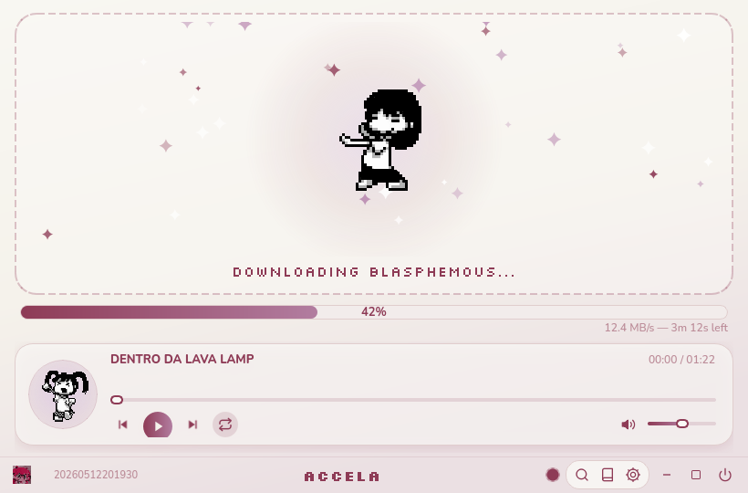

# accela-easy-install

Full installation, custom aesthetic theme, integrated music player, and automated SLSsteam setup for ACCELA on Linux.

<div align="center">




</div>

## Overview

This repository provides an automated installation script and custom theme for ACCELA (Serial Experiments Lain themed game client) on Linux.

It handles SLSsteam installation and configuration (`PlayNotOwnedGames: yes`), applies a dreamy Y2K theme, disables the 50Hz electrical hum, sets up Hyprland floating window rules, and embeds an aesthetic music player with dancing pixel art.

### Theme

- Soft pastel gradients, rounded cards and pill buttons across the main window and every dialog, all derived from the accent and background colors you pick in Settings → Style.
- Nunito for text and Silkscreen for pixel titles (both bundled, SIL Open Font License).
- While a game downloads, a Yume Nikki dancer appears over a glowing stage with twinkling sparkles.
- Floating music player card with a real-time CAVA visualizer.

Re-running `install.sh` or `apply-theme.sh` keeps your settings; theme colors are only set on the first apply.

## Installation

Run the one-line installer:

```bash
curl -fsSL https://raw.githubusercontent.com/gabesvr/accela-easy-install/main/install.sh | bash
```

The script detects your Linux package manager (Arch/CachyOS, Debian/Ubuntu, Fedora, OpenSUSE, Void), installs dependencies, downloads ACCELA, configures SLSsteam, and applies the theme and shortcuts.

If you already have ACCELA installed and just want the theme:

```bash
git clone https://github.com/gabesvr/accela-easy-install.git
cd accela-easy-install
./apply-theme.sh
```

## Setup

To search and download games directly through the interface:

1. Log in with Discord at [hubcapmanifest.com](https://hubcapmanifest.com/).
2. Get your key at [hubcapmanifest.com/api-keys/user](https://hubcapmanifest.com/api-keys/user).
3. In ACCELA, open Settings (gear icon) -> Integrations.
4. Paste your Morrenus API Key and save.

You can also drag and drop `.zip` manifest files directly into the window without an API key.

## Custom Music

Drop your `.mp3` files into `~/.local/share/ACCELA/music/`. The player will automatically detect and play them.

## Credits

- [CiscoSweater (ciskao)](https://github.com/ciscosweater) - [enter-the-wired](https://github.com/ciscosweater/enter-the-wired) installer and Linux packaging.
- [AceSLS](https://github.com/AceSLS/SLSsteam) - SLSsteam.
- Tachibana Labs / Morrenus - Original ACCELA client.
- gabesvr - Theme design, music player integration, and automated installer.
